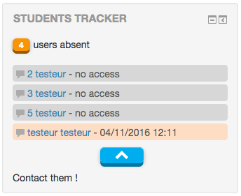

# Moodle Student's tracker block

This plugin adds a new block type for Moodle. Its aim is to give the teachers and staff a simple tool to view how many students didn't visit a course for a long time and so, try to reduce student's leaving.

##Features

The block is customizable :
<ul>
	<li>block's title</li>
	<li>choose the roles and groups you want to track</li>
	<li>choose the roles able to see the block</li>
	<li>set the number of days from last connection required to track users</li>
	<li>set an amount of results to display (the rest can be toggled with a button)</li>
</ul>

It also includes a link to open the direct Moodle message dialog, allowing teachers and managers to contact the tracked users in very a fast and easy way.

##Settings translations

<ul>
	<li>English</li>
	<li>French</li>
	<li>Portuguese</li>
</ul>

##Install

Clone or unzip the repository inside your Moodle block folder (example /var/www/moodle/blocks).