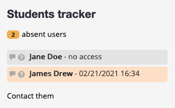

# Moodle Student's tracker block

This plugin adds a new block type for Moodle. Its aim is to give the teachers and staff a simple tool to view how many students didn't visit a course for a long time and so, try to reduce student's leaving.

Users with the role "student" won't see it, but users with higher roles will.

The block is customizable :
<ul>
	<li>block's title</li>
	<li>number of days from last connection required to track users</li>
	<li>alert colors via color picker</li>
	<li>role to track</li>
</ul>

#Install

Clone or unzip the repository inside your Moodle block folder (/var/www/moodle/blocks) or wherever your Moodle root folder is located.

#Miscellaneous

The color picker use the Flexi Color Picker library <a href="https://github.com/DavidDurman/FlexiColorPicker">https://github.com/DavidDurman/FlexiColorPicker</a>
